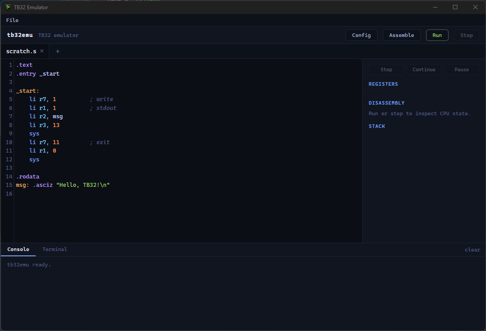

# tb32emu

A graphical emulator and assembly IDE for the **TB32** instruction set, built on top of [libtb32](https://github.com/Tonic-Box/libtb32).

This is the CPU ISO that [TonicBoxOS](https://tonicbox.dev/) is built on.



## Build and run

```
zig build run                        # build and launch
zig build test                       # unit tests
zig build -Doptimize=ReleaseFast     # optimized build in zig-out/bin/
```

Requires Zig 0.13 to build.

## Web build

The same emulator also builds to a self-contained static web bundle (WebAssembly core plus
the frontend), for hosting in a browser:

```
zig build web                        # build the static web bundle
zig build web -Dweb-out=PATH         # write the bundle to PATH (default: ../emulator)
```

This compiles a `wasm32-freestanding` build of the emulator and writes `index.html`,
`tb32emu.wasm`, and the supporting assets to the output directory, ready to serve as static
files. The desktop `zig build`/`zig build run` targets are unaffected.

## Shortcuts

- **Ctrl-B** - assemble the active file
- **Ctrl-S** - save the active file

## License

[MIT](LICENSE). Bundled third-party components and their licenses are listed in
